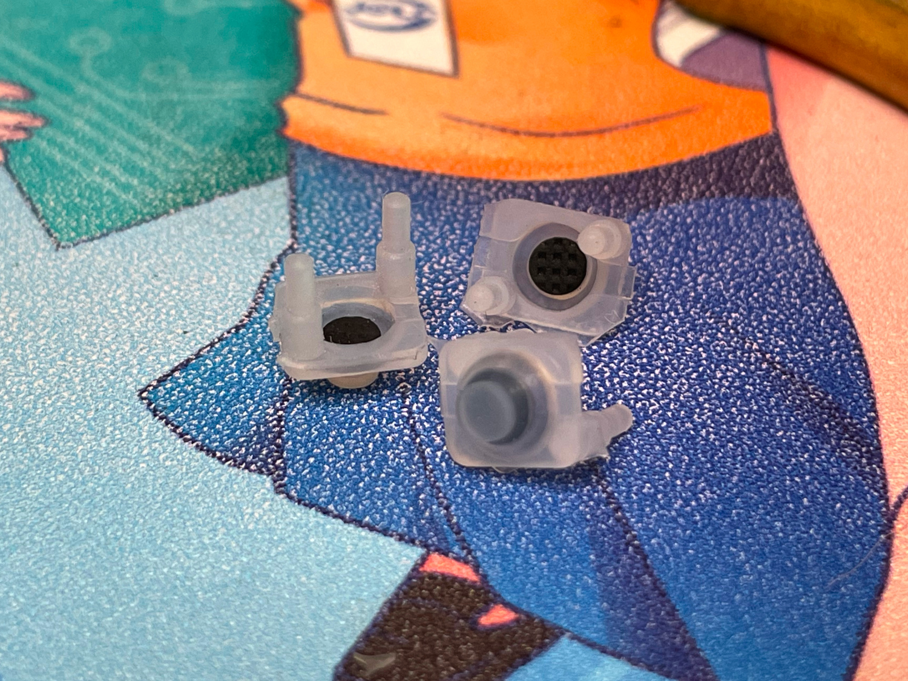
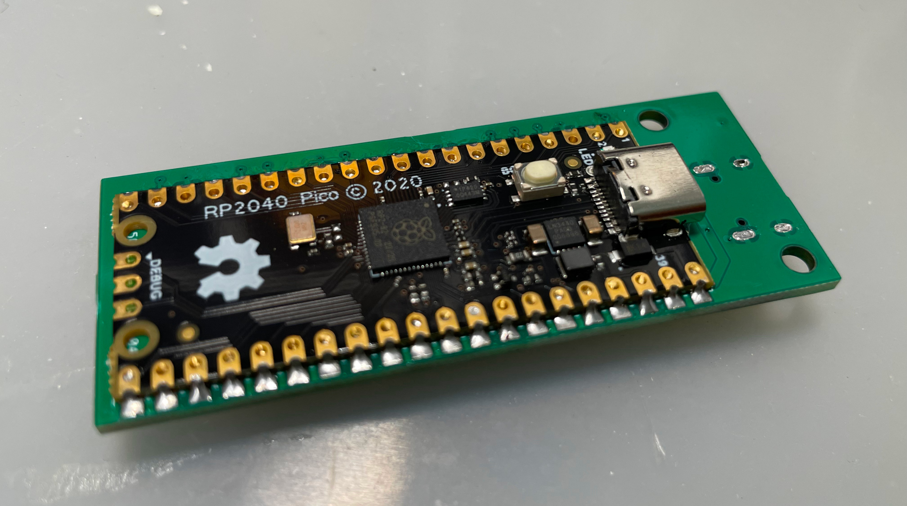
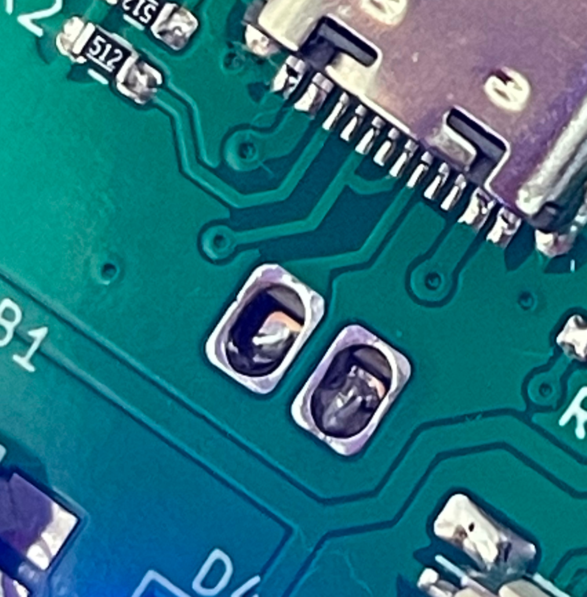
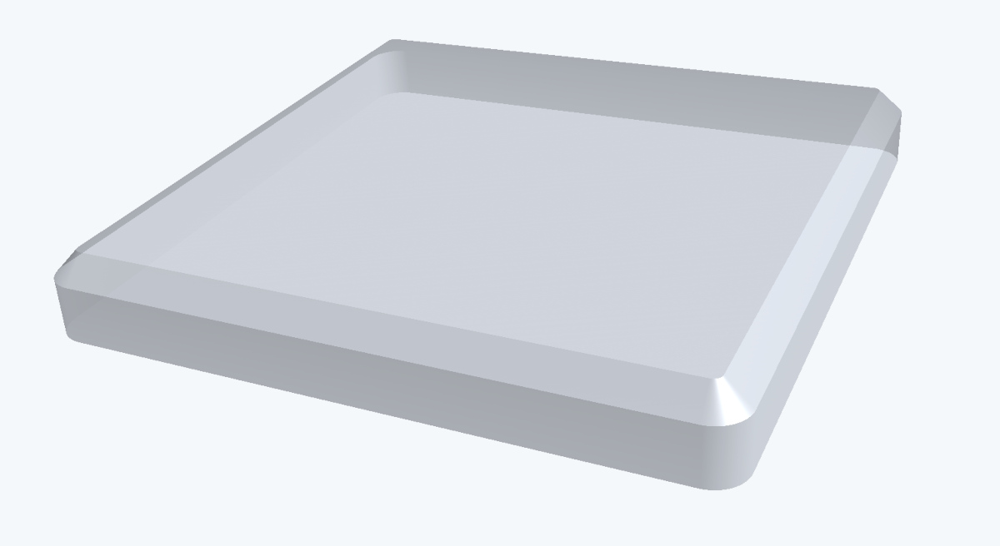
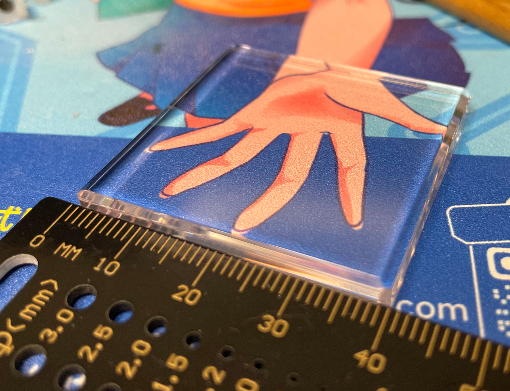
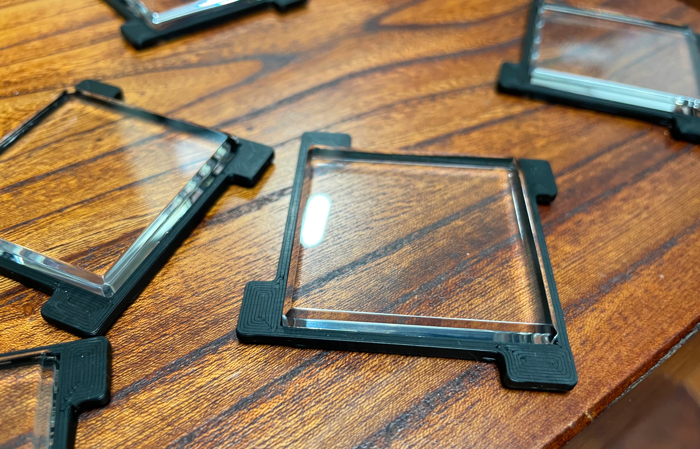
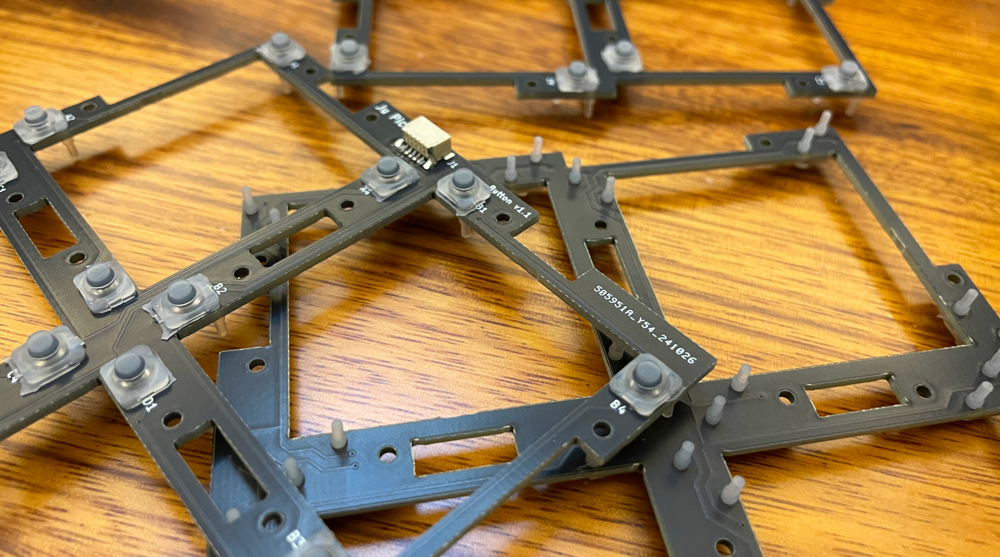
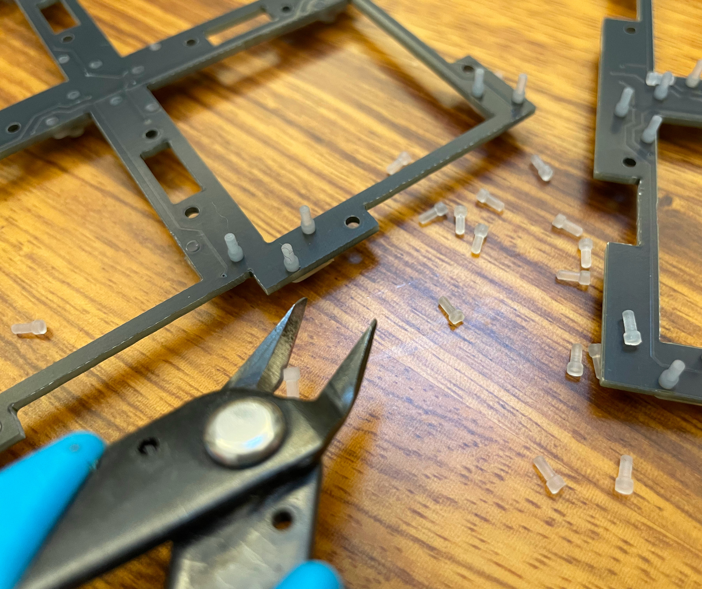
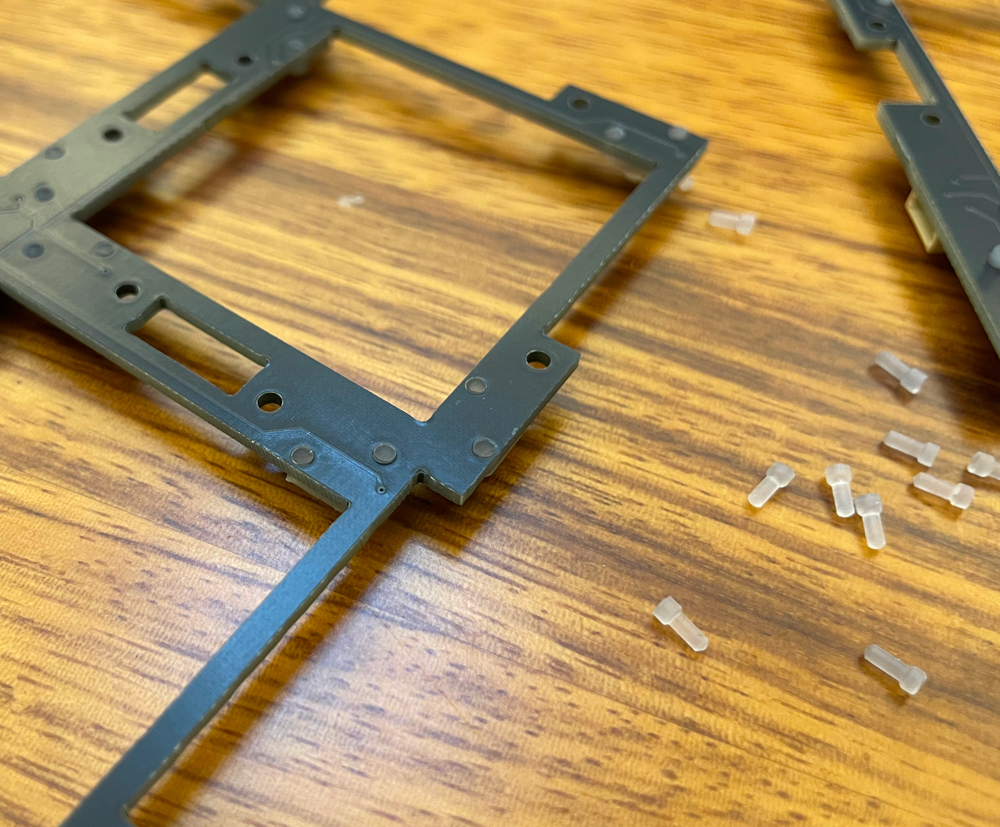
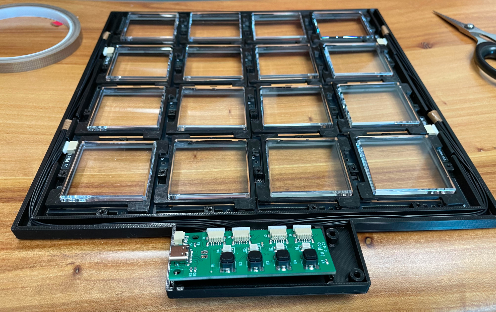

# Ju Pico - Jubeat Style Mini Controller
[点这里可以切换到中文版](README_CN.md)

 

Ju Pico is physical button based. Ju Pico Touch (Ju Touch) is a touch screen based variant. This repository contains both of them.

Features:
* Designed for 15.6" portable monitor.
* It's small but closely replicates the feel of the arcade.
* Can be placed in 4 different orientations (rotations).
* Command line for configurations.
* All source files open.

Thanks to many respectful guys/companies who made their tools or materials free or open source (KiCad, OnShape, InkScape, Raspberry things).

Special thanks to community projects and developers.
And also these projects:
* RP_Silicon_KiCad: https://github.com/HeadBoffin/RP_Silicon_KiCad
* Type-C: https://github.com/ai03-2725/Type-C.pretty

## My Other Projects
You can check out my other cool projects.

          

* Popn Pico: https://github.com/whowechina/popn_pico
* IIDX Pico: https://github.com/whowechina/iidx_pico
* IIDX Teeny: https://github.com/whowechina/iidx_teeny
* Chu Pico: https://github.com/whowechina/chu_pico
* Mai Pico: https://github.com/whowechina/mai_pico
* Diva Pico: https://github.com/whowechina/diva_pico
* AIC Pico: https://github.com/whowechina/aic_pico
* Groove Pico: https://github.com/whowechina/groove_pico
* Geki Pico: https://github.com/whowechina/geki_pico
* Musec Pico: https://github.com/whowechina/musec_pico
* Ju Pico: https://github.com/whowechina/ju_pico

## **Disclaimer** ##
I made this project in my personal time with no financial benefit or sponsorship. I will continue to improve the project. I have done my best to ensure that everything is accurate and functional, there's always a chance that mistakes may occur. I cannot be held responsible for any loss of your time or money that may result from using this open source project. Thank you for your understanding.

## About the License
It's CC-NC. So DIY for yourself and for your friend, don't make money from it. And plagiarism that doesn’t even dare to mention the original author is not acceptable. Plase note that pooling orders and group buying for raw materials is acceptable. Selling off any leftover components without profit is also acceptable.

If you're interested in buying from me, or for commercial use, please contact me (Discord, QQ group, Wechat group or leave your contact in issue section).

## My Discord Invitation
https://discord.gg/M8f2PPQFEA

## HOW TO BUILD JU PICO
### PCB and Components
* Go JLCPCB and make order with the gerber zip files (latest `Production\PCB\ju_io_xxx.zip` and `Procution\PCB\ju_button_xxx.zip`), regular FR-4 board, black color, **1.6mm** thickness.
* 1x Rasberry Pico Pi Pico or pin-to-pin compatible clones (U1).  
  https://www.raspberrypi.com/products/raspberry-pi-pico
* 1x USB Type-C socket (918-418K2023S40001 or KH-TYPE-C-16P)
* 4x WS2812B-3528 RGB LEDs.
* 4x Alps SKPMAPE010 6.0×5.9mm tactile switch in black, Panasonic EVQP1K05M works too, but it only comes in a white version.  
  https://tech.alpsalpine.com/e/products/detail/SKPMAPE010/
* 1x 0603 0.1uF (0.1~1uF all fine) capacitor (C1).
* 2x 0603 5.1kohm resistors (R1, R2) for the USB.
* 2x 0603 10ohm resistor, (1-20ohm all work fine) (R3, R4).
* 8x JST-SH1.0 5-pin SMD connectors (J1 to J4 on IO PCB, and 4 others on button PCBs).
* 1x JST-SH1.0 3-pin SMD connector (J5), optional for future HID light expansion.
* 4x JST-SH1.0 dual-end 5-pin cables (pin 1 to pin 1 mapping): 2 cables of 20cm length, and 2 cables of 30cm length.
* 64x Silicone rubber buttons, **6mm\*7mm**, **4mm** height, with 2 legs. Buy soft (lower actuation force) ones if possible. It looks like this:  
  
* This is how the I/O board looks after soldering.  
    
  
* Becareful of 2 pin holes. It's a common oversight to either forget to solder them or to leave air bubbles during the process. To avoid this, solder slowly from one side of the hole, using minimal solder wire and a generous amount of flux.  
  

### Test the IO PCB
* You can test the PCB now, put the firmware in IO PCB.
* All 4 RGB LEDs should light up in a rainbow pattern.
* LEDs responds to the the leftmost button, indicating current orientation.
* Ju Pico should be recognized as a USB HID device, here's the test page.  
  https://greggman.github.io/html5-gamepad-test/
* Connect the 4 button PCBs to the IO PCB, and use one rubber button to test the button contacts on the PCB, you'll see the status change in said HID test page.

### Button Cap
Ju Pico has 16 buttons, so you need to order 16 button caps.

They are made of clear acrylic, measuring 40mm x 40mm with a corner radius of 1-1.5mm and a thickness of 5mm. All these parameters are IMPORTANT and should be followed closely. A polished bevel of **1.5-2mm** on top edges gives a better feel.

Here's what it looks like.  
 

### 3D Printing
#### Printing parameters
* PLA (recommended) or PETG.
* Layer height: 0.2mm.
* Walls: 5.
* Infill: >=80%.
* Support: Yes, better with special support material.
* Glue on bed: Yes, it prevents corner warping.
* Files are always in milimeter unit, not inch.

#### Parts
* Frame: `Production\3DPrint\ju_pico_frame.stl`, black.
* Panel: `Production\3DPrint\ju_pico_panel.stl`, black, print up-side-down with support (use special support material if possible).
* Banner: `Production\3DPrint\ju_pico_banner.3mf`, multi-color, print up-side-down, mainbody is black, LED windows are transparent, logos are red or orange, use special support material if possible.
* 16x Button Seats: `Production\3DPrint\ju_pico_button_seat_*.stl`, black, print up-side-down to avoid overhanging. Choose the one that fits your button cap.
* All together, they look like these.  
  
* Note: Files with "bambu" in the name are project files prepared for Bambu Studio.

### Assembly
#### Other Materials Needed
1. Clear soft/flexible glue or UV curing glue. WARNING: Avoid using any cyanoacrylate-based glue, such as 502. Any glue with a similar smell should also be avoided, as they will leave white smoke marks on the acrylic.
2. 40x **M2\*6mm** screws, black, for the panel.
3. 4x **M3\*8mm** screws, black, for the banner.

### Step by Step
1. Glue the button bodies to the button seats. Be careful don't let the glue ruin the acrylic. See the "Caution" section below for more details.  
   
2. Insert the silicone rubber buttons into the button PCBs. Ensure to pull the legs so that the button sits perfectly flush against the PCB.  
   
3. Use a sharp side cutter to trim the legs of the rubber buttons so that they are flush with the PCB, leaving no protruding parts.  
    
4. Put button PCBs into the frame part and use the cables to connect them to the IO PCB.  
   
5. Arrange the cables and make them fit in the cable slots.  
   
6. If you arrange them well, it will look very neat.  
   
7. Gently put the finished buttons onto the button PCBs.  
   
8. Attach the panel part and secure it with (a lot) M2 screws. Be very careful, 3D print materials are fragile and sensitive to heat. So screw slowly, especially when using a power screwdriver, as the threads in the plastic can easily strip. Lastly put on the banner part and use M3 screws to fix it. And there you go!  
   

#### Caution
Each 3D printer and filament has its own tolerance, as does the acrylic cutting service. Therefore, I've created multiple versions of the button seat. You can try them and select the one that fits your acrylic button cap perfectly.

## HOW TO BUILD JU PICO (Please wait until I finish)
### PCB and Components
### Test the PCB
### ITO Glass
### 3D Printing
### Assembly

## Firmware
* UF2 file is in `Production\Firmware` folder.
* For the new build, hold the BOOTSEL button while connect the USB to a PC, there will be a disk named "RPI-RP2" showed up. Drag the UF2 firmware binary file into it. That's it. There's a small hole at the bottom side of the Ju Pico, it is facing right to the BOOTSEL button.
* If it's already running Ju Pico firmware, you can either use "update" in command line or hold down at least 4 buttons while connecting to USB to enter update mode.
* To access the command line, you can use this Web Serial Terminal to connect to the USB serial port of the Ju Pico. (Note: "?" is for help)  
  https://googlechromelabs.github.io/serial-terminal/

### Usage
* Attach the Ju Pico or Ju Touch to a 15.6-inch portable monitor using VHB residue-free adhesive tape. Use 3 to 4 small pieces on the monitor's frame, but avoid placing any on the screen. Position it in the orientation that best suits your needs.
* Use the button closest to the left edge (when the 'Ju Pico' or 'Ju Touch' logo is upright) to set button mapping that matches your orientation. Analog joystick in HID report indicates which side the logo should be. You can use the following website to see the joystick status.  
  https://greggman.github.io/html5-gamepad-test/

## CAD Source File
I'm using OnShape free subscription. It's powerful but it can't archive original designs to local, so I can only share the link here. STL/DXF/DWG files are exported from this online document.  
  https://cad.onshape.com/documents/c70fd7c4cb933fd28c4678b3/w/277dab41d8d592c817e9419a/e/e9cf38ee55134a09b2deb5d6
