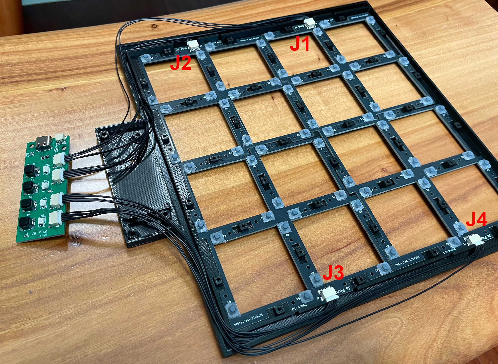

# Ju Pico - Jubeat 风格的迷你控制器
[Click here for the English version of this guide.](README.md)

特性：
* 专为 15.6" 便携显示器设计。
* 尽管很小，但还原了街机的感觉。
* 可以放置 4 种不同的方向（旋转）。
* 命令行配置。
* 所有源文件开放。

感谢许多尊敬的爱好者和公司将他们的工具或材料免费或开源（KiCad，OnShape，InkScape，Raspberry 相关工具, 嘉立创，等）。

特别感谢社区项目和开发者的帮助，还有如下项目：
* RP_Silicon_KiCad: https://github.com/HeadBoffin/RP_Silicon_KiCad
* Type-C: https://github.com/ai03-2725/Type-C.pretty

## 其他项目
你也可以查看我其他的酷炫项目。

           

* Popn Pico: https://github.com/whowechina/popn_pico
* IIDX Pico: https://github.com/whowechina/iidx_pico
* IIDX Teeny: https://github.com/whowechina/iidx_teeny
* Chu Pico: https://github.com/whowechina/chu_pico
* Mai Pico: https://github.com/whowechina/mai_pico
* Diva Pico: https://github.com/whowechina/diva_pico
* AIC Pico: https://github.com/whowechina/aic_pico
* Groove Pico: https://github.com/whowechina/groove_pico
* Geki Pico: https://github.com/whowechina/geki_pico
* Musec Pico: https://github.com/whowechina/musec_pico
* Ju Pico: https://github.com/whowechina/ju_pico

## **声明** ##
我在个人时间内制作了这个项目，没有任何经济利益或赞助。我将继续改进这个项目。我已尽我所能确保所有内容的准确性和功能性，但总有可能出现错误。如果你因使用这个开源项目而造成时间或金钱的损失，我不能负责。感谢你的理解。

## 关于许可证
它是 CC-NC 授权。所以你只能给自己和你的朋友 DIY，不能利用这个项目赚钱，比如收费的代做，出售整机等，连源作者都不敢提的抄袭或者稍微改改换个名字来打擦边球就更不可以了。注意团购和拼单订购原始元器件是合理的，非盈利的方式卖掉剩余的元器件也是可以接受的。

如果希望找我购买成品或者获取商用授权，请联系我（Discord，QQ 群，闲鱼，微信群或者在 issue 区留下你的联系方式）。

## 我的 Discord 服务器邀请
https://discord.gg/M8f2PPQFEA

## 如何制作 Ju Pico
### PCB 及元器件
* 去 JLCPCB 下单，使用最新的 `主控 PCB` 和 `按钮 PCB`，gerber 文件分别是 `Production\PCB\ju_io_xxx.zip` 和 `Procution\PCB\ju_button_xxx.zip`，常规的 FR-4 板材，黑色，**1.6mm** 厚度。
* 1x Rasberry Pico Pi Pico 或者兼容的克隆板（U1）。  
  https://www.raspberrypi.com/products/raspberry-pi-pico
* 1x USB Type-C 插座 (918-418K2023S40001 或 KH-TYPE-C-16P)
* 4x WS2812B-3528 RGB LED（板上所有 RGB LED）。
* 4x Alps SKPMAPE010 6.0×5.9mm 黑色轻触按钮，也可以用松下的 EVQP1K05M，但它只有白色版本。  
  https://tech.alpsalpine.com/e/products/detail/SKPMAPE010/
* 1x 0603 0.1uF 电容（0.1~1uF 都可以）（C1）。
* 2x 0603 5.1kohm 电阻（R1, R2）用于 USB。
* 2x 0603 10ohm 电阻（1-20ohm 都可以）（R3, R4）。
* 8x JST-SH1.0 5P 贴片插座 (`主控 PCB` 上的 J1 到 J4，以及 `按钮 PCB` 上的插座）。
* 1x JST-SH1.0 3P 贴片插座（J5), 可选，也许未来可扩展 HID 灯光。
* 4x JST-SH1.0 双头 5P 排线（引脚一对一，经常被叫做双头反向），2 根 20 厘米的，2 根 30 厘米的。
* 64x 硅橡胶导电橡胶按钮，**6mm\*7mm**, **4mm** 高度，带两个脚，如果可能，尽量买软（触发力度小）一点的。它看上去像这样：  
  
* `主控 PCB` 焊接完成后这个样子：  
    
  
* 注意这两个引脚的焊接，很容易疏忽，要么忘记焊，要么在过程中留下气泡。为了避免这种情况，从孔的一侧开始慢慢焊接，要用尽量少的焊丝和较多的助焊剂。  
  

### 测试 `主控 PCB`
* 现在你可以测试 PCB 了，将固件烧录到 `主控 PCB` 中。
* 4 个 RGB LED 应该以彩虹模式点亮。
* LED 会响应最左边的按钮，指示当前方向。
* Ju Pico 应该被识别为一个 USB HID 设备，这里是测试页面。  
  https://greggman.github.io/html5-gamepad-test/
* 将 4 个 `按钮 PCB` 连接到 `主控 PCB`，可以用一个导电橡胶按钮测试 PCB 上的按钮接触点，你应该能看到测试页面中的按钮状态变化。

### 按钮帽
Ju Pico 有 16 个按钮，所以你需要订购 16 个按钮帽。

它们是透明亚克力的，尺寸为 **40mm\*40mm**，边角导圆角，半径为 **1-1.5mm**，厚度为 **5mm**，这些参数都很重要，应该严格遵循。顶面四边做 **1.5-2mm** 的倒边（斜面）并抛光会带来更好的手感。

这是按钮帽的样子。  
 

### 3D 打印
#### 打印参数
* PLA （推荐）或者 PETG。
* 层高：0.2mm。
* 墙：5 层。
* 填充：80% 以上。
* 支撑: 是的，最好使用专门的易剥离材料。
* 热床胶水：是的，它可以防止翘边。
* 注意文件内的尺寸单位都是毫米，不是英寸。

#### 打印部件
* 框体你有两个选择，选择其一即可。
  * 直接将螺丝拧入打印材料：`Production\3DPrint\ju_pico_frame.stl`，黑色。组装更容易，但螺丝容易磨损或者拧坏打印材料。
  * 将螺丝拧到六角螺母上：`Production\3DPrint\ju_pico_frame_hexnut.stl`，黑色。组装稍微复杂一点，但螺母不容易磨损。
* 盖板: `Production\3DPrint\ju_pico_panel.stl`, 黑色，倒置打印，开启支撑（最好用专门的支撑材料）。
* 标志面板: `Production\3DPrint\ju_pico_banner.3mf`, 多色，倒置打印，主体黑色，LED 窗口透明色，Logo 用红色或者桔色，开启支撑（最好用专门的支撑材料）。
* 16x 按钮座: `Production\3DPrint\ju_pico_button_seat_*.stl`, 黑色，倒置打印避免悬空，注意选择和你亚克力按钮帽尺寸最相符的那个文件。
* 所有这些看上去长这样。  
  
* 注意：文件名带 "bambu" 的是给 Bambu Studio 准备的工程文件。
* 警告：请不要混用 2024 年 12 月之前和之后的文件，因为我在 2024 年 12 月初做了一些不兼容改动。

### CNC 铝合金加工（可选）
* 如果你喜欢那种金属质感并且不介意多花很多钱，你可以选择用铝合金加工框体、面板和标志部分。
* 可以选择喷砂和阳极氧化来让它更好看一点。
* STEP 文件在 `Production\CNC` 文件夹，2D 的 DWG 文件是框体部分的螺纹攻丝图。
* 你还需要 3D 打印 `Production\3DPrint\ju_pico_led_diffuser_for_cnc.stl` 用于 LED 的匀光，要用透明材料。

### 组装
#### 其他所需材料
1. 透明软性胶或者 UV 固化胶。警告：避免使用任何氰基胶，比如 502 胶。任何有类似气味的胶也要避免，因为它们会在亚克力上留下白色雾化痕迹。
2. 40x **M2\*6mm**（普通框体用）或者 **M2\*7mm**（六角螺母框体用）螺丝，黑色，用于固定面板。
3. 4x **M3\*8mm** 螺丝，黑色，用于标志面板。

### 步骤
1. 把按钮帽粘到按钮座上。小心不要让胶水弄脏亚克力。查看下面的 "注意" 部分了解更多细节。  
   
2. 把硅橡胶按钮插入 `按钮 PCB`。注意拉一下按钮的两个脚，使按钮完全贴合 PCB。  
   
3. 使用锋利的斜口剪（水口剪）修剪硅橡胶按钮的脚，使它们与 PCB 齐平，不要有任何突出的部分。  
    
4. 把 `按钮 PCB` 放入框体部分，使用排线连接到 `主控 PCB`。  
   
5. 整理好排线，使它们能够放进线槽。  
   
6. 如果你整理得好，它看上去会很整洁。  
   
7. 小心翼翼的把粘好的按钮放到 `按钮 PCB` 上。  
   
8. 用（很多很多）M2 螺丝把面板部分固定到框体上。注意要非常小心，3D 打印材料很脆弱而且怕热。慢慢拧，尤其是使用电动螺丝刀时要特别注意，因为螺纹很容易就会拧废了。最后放上标志部分，用 M3 螺丝固定。完成！  
   

#### 注意
每台 3D 打印机和每种材料都有自己的公差，亚克力切割服务也是如此。因此，我为按钮座创建了多个版本，你可以尝试并选择最适合你亚克力按钮帽的那个。

### 固件
* UF2 文件在 `Production\Firmware` 文件夹中。
* 对于新的固件，按住 BOOTSEL 按钮连接到 USB，会出现一个名为 "RPI-RP2" 的磁盘。将 UF2 固件二进制文件拖入其中。就这样。Musec Pico 的底部有一个小孔，它正对着 BOOTSEL 按钮。
* 如果已经烧录过 Musec Pico 固件，你可以使用命令行中的 "update" 或者在插入 USB 的时候按住至少 4 个按钮来进入更新模式。
* 要访问命令行，你可以使用这个 Web 串口终端连接到 Musec Pico 的 USB 串口。（注意："?" 是帮助）  
  https://googlechromelabs.github.io/serial-terminal/

### 使用
* 把 Ju Pico 贴到一个 15.6 英寸的便携显示器上，需要使用 VHB 无痕胶带（国内也叫“点点胶”）。在显示器的外框上用 3 到 4 片就够，注意不要粘到屏幕上。你可以选择你最喜欢的朝向。
* 用最靠左的按钮（'Ju Pico' 标志正立时）来切换按钮映射，使其与你的朝向匹配。HID 汇报的模拟摇杆的位置指示了 Logo 应该在哪侧。你可以使用下面的网站查看摇杆状态。  
  https://greggman.github.io/html5-gamepad-test/

## CAD 源文件
我使用的是 OnShape 的免费订阅。它很强大，但不能将原始设计存档到本地，所以我只能在这里分享链接。STL/DXF/DWG 文件是从这个在线文档导出的。  
  https://cad.onshape.com/documents/c70fd7c4cb933fd28c4678b3/w/277dab41d8d592c817e9419a/e/e9cf38ee55134a09b2deb5d6
